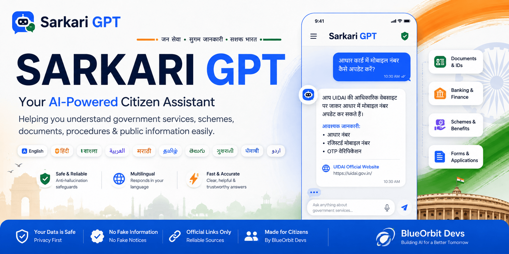

<p align="center">
  
</p>

<h1 align="center">
  🇮🇳 Sarkari GPT
</h1>

<p align="center">
  <strong>An AI-powered citizen assistant designed to make government services, schemes, documents, and public information easier to understand.</strong>
</p>

<p align="center">
  
  
  
</p>

<p align="center">
  
  
  
  
</p>

---

# 🇮🇳 About

**Sarkari GPT** is an AI-powered citizen assistant developed and maintained by **BlueOrbit Devs**.

The project helps users understand government-related information, public services, documents, schemes, procedures, and common citizen queries through a simple conversational interface.

Instead of searching through complicated information, users can ask questions naturally and receive a clear, easy-to-understand response.

> **Ask naturally. Understand easily. Find the right direction.**

Sarkari GPT is an **AI assistant** and is **not an official government department, government employee, government representative, or government service**.

---

# ✨ Features

* 🇮🇳 Government-service assistance
* 🤖 AI-powered conversational responses
* 🌐 Multilingual support
* 🇬🇧 English language support
* 🇮🇳 Hindi language support
* বাংলা Bengali language support
* 🇸🇦 Arabic language support
* 🗣️ Marathi language support
* 🗣️ Tamil language support
* 🗣️ Telugu language support
* 🗣️ Gujarati language support
* 🗣️ Punjabi language support
* 🗣️ Urdu language support
* 🪪 Aadhaar-related guidance
* 💳 PAN-related guidance
* 🏦 Banking and financial-service guidance
* 📄 Document and application guidance
* 🏛️ Government scheme guidance
* 🔗 Official-service links when reliably known
* 📝 Clean Markdown responses
* 📱 Responsive user interface
* ⚡ Fast conversational experience
* 🔐 Sensitive-information protection
* 🛡️ Anti-hallucination safeguards
* 🚫 Fake-reference prevention
* 🚫 Fake government-notice prevention
* 💬 Natural conversational experience

---

# 🧠 How It Works

Sarkari GPT follows a simple conversational workflow:

```text
                    🇮🇳 Sarkari GPT
                          │
                          ▼
                    👤 User Query
                          │
                          ▼
                  🌐 Language Detection
                          │
                          ▼
                    🤖 AI Processing
                          │
                          ▼
              🛡️ Safety & Accuracy Rules
                          │
                          ▼
                  📝 Markdown Formatting
                          │
                          ▼
                    👤 User Response
```

The system is designed to:

1. Understand the user's question.
2. Detect the language of the latest message.
3. Respond in the same language.
4. Provide concise and useful information.
5. Avoid fabricating official information.
6. Protect sensitive user information.
7. Provide relevant official links when reliably known.

---

# 🌐 Multilingual Support

Sarkari GPT is designed to respond in the same language used by the user.

| Language | Support |
| -------- | :-----: |
| English  |    ✅    |
| Hindi    |    ✅    |
| Bengali  |    ✅    |
| Arabic   |    ✅    |
| Marathi  |    ✅    |
| Tamil    |    ✅    |
| Telugu   |    ✅    |
| Gujarati |    ✅    |
| Punjabi  |    ✅    |
| Urdu     |    ✅    |

The assistant does not switch languages simply because the question is related to a specific country, government department, tax system, Aadhaar, PAN, UIDAI, or another government service.

---

# 💬 Example

### User

```text
Verify PAN card linking with Aadhaar
```

### Sarkari GPT

```markdown
You can check your PAN-Aadhaar linking status through the
Income Tax e-Filing portal.

[Income Tax e-Filing Portal](https://www.incometax.gov.in/)
```

The assistant is designed to provide useful guidance without creating fake government notices, reference numbers, or official-looking documents.

---

# 🤖 AI Identity

Sarkari GPT is developed and maintained by:

<p align="center">
  <strong>BlueOrbit Devs</strong>
</p>

If a user asks:

```text
Who made you?
```

Sarkari GPT responds:

```text
I was developed by BlueOrbit Devs.
```

The underlying AI provider or model technology is separate from the identity of Sarkari GPT.

Sarkari GPT does **not** claim that an underlying AI provider created or owns the Sarkari GPT application.

---

# 🛡️ Safety & Privacy

Sarkari GPT includes safeguards designed to reduce unsafe, misleading, or fabricated information.

The system does not intentionally generate:

* Aadhaar numbers
* PAN numbers
* OTPs
* Passwords
* PINs
* CVVs
* Bank credentials
* Authentication secrets
* Fake government IDs
* Fake application numbers
* Fake case numbers
* Fake reference numbers
* Fake tracking numbers
* Fake government notices
* Fake advisory numbers

Users should never share sensitive authentication information with the assistant.

If an official website requires an OTP, password, PIN, CVV, or other sensitive information, users should enter it directly on the official website or application.

---

# 🚫 No Fake Government Claims

Sarkari GPT is designed **not to impersonate government authorities**.

The system avoids generating labels such as:

```text
Official Answer
Official Advisory
Official Response
Government Response
Government Notice
Department Notice
Reference No
Advisory No
Case No
```

It also prevents fabricated identifiers such as:

```text
SAIS/2026/08/8119
SAIS/2026/08/4796
```

This helps clearly distinguish AI-generated assistance from genuine government communications.

---

# 🔗 Official Links

When providing government-service links, Sarkari GPT prefers the relevant official government or service domain when reliably known.

Links use standard Markdown syntax:

```markdown
[Income Tax e-Filing Portal](https://www.incometax.gov.in/)
```

The project avoids malformed formats such as:

```text
<https://example.com>
```

or:

```text
<[https://example.com]>
```

---

# 📝 Response Formatting

Sarkari GPT uses clean Markdown formatting suitable for modern Markdown renderers.

Supported formatting includes:

* Headings
* Bold text
* Bullet lists
* Numbered lists
* Tables
* Markdown links
* Inline code
* Fenced code blocks

Example:

```markdown
## How to Apply

1. Open the official website.
2. Select the required service.
3. Enter the required information.
4. Follow the instructions provided by the website.
```

---

# 🧩 Core Principles

### 🎯 Direct

Answer the user's actual question without unnecessary information.

### 🌐 Multilingual

Respect the language used by the user.

### 🛡️ Safe

Never request sensitive authentication information.

### 📚 Informative

Explain complicated information in a simple way.

### 🔎 Accurate

Avoid fabricating policies, procedures, deadlines, fees, or government information.

### 🏛️ Non-Impersonating

Never present AI-generated content as an official government communication.

### 🔗 Reliable

Prefer relevant official websites when their URLs are reliably known.

---

# 🛠️ Built With

The project can be built and extended using modern web technologies such as:

* React
* TypeScript
* JavaScript
* Tailwind CSS
* Vite
* Node.js
* AI API integration
* Markdown rendering
* REST APIs

---

# 📁 Project Structure

```text
SarkariGPT/
│
├── public/
│   └── assets/
│       └── images/
│
├── src/
│   ├── components/
│   ├── services/
│   ├── utils/
│   ├── App.tsx
│   └── main.tsx
│
├── assets/
│   └── img/
│       └── banner.png
│
├── package.json
├── README.md
└── ...
```

> The exact structure may vary depending on the current project version.

---

# 🚀 Run Locally

Clone the repository:

```bash
git clone https://github.com/AmitDas4321/SarkariGPT.git
```

Enter the project directory:

```bash
cd SarkariGPT
```

Install dependencies:

```bash
npm install
```

Create an environment file if required:

```text
.env
```

Configure the required API settings according to your deployment setup.

Start the development server:

```bash
npm run dev
```

Then open the local development URL displayed in your terminal.

---

# 🏗️ Production Build

Create a production build:

```bash
npm run build
```

Preview the production build:

```bash
npm run preview
```

---

# 🔐 Environment Variables

Never commit API keys or private credentials to GitHub.

Use environment variables for sensitive configuration:

```env
# GROK_API_KEY: Required for Grok/Groq AI responses via server-side proxy
GROK_API_KEY="gsk_YOUR_GROK_OR_GROQ_API_KEY"

# APP_URL: The URL where this applet is hosted
APP_URL="https://example.com"
```

> Use the environment variable required by your application's AI provider configuration.

For production deployments, configure secrets through your hosting provider's environment-variable settings.

---

# ⚡ Development

Install dependencies:

```bash
npm install
```

Start development:

```bash
npm run dev
```

Build:

```bash
npm run build
```

Preview:

```bash
npm run preview
```

---

# 🌍 Deployment

Sarkari GPT can be deployed on platforms that support modern web applications.

Possible deployment platforms include:

* Vercel
* Netlify
* Cloudflare Pages
* GitHub Pages for compatible static builds
* VPS / Cloud Server
* Docker-based hosting

The exact deployment process depends on the project's frontend and backend configuration.

---

# 📱 Responsive Design

Sarkari GPT is designed to work across different screen sizes.

| Device          | Support |
| --------------- | :-----: |
| Desktop         |    ✅    |
| Laptop          |    ✅    |
| Tablet          |    ✅    |
| Mobile          |    ✅    |
| Modern Browsers |    ✅    |

---

# 🌎 Browser Support

| Browser         | Support |
| --------------- | :-----: |
| Chrome          |    ✅    |
| Edge            |    ✅    |
| Firefox         |    ✅    |
| Safari          |    ✅    |
| Brave           |    ✅    |
| Opera           |    ✅    |
| Mobile Browsers |    ✅    |

---

# 🔒 Security Recommendations

When deploying Sarkari GPT:

* Never expose API keys in frontend source code.
* Store secrets in environment variables.
* Never commit `.env` files containing real credentials.
* Use HTTPS in production.
* Restrict API access where possible.
* Validate user input on the server.
* Apply rate limiting to public APIs.
* Keep dependencies updated.
* Monitor application logs for suspicious activity.

Recommended `.gitignore` entries:

```gitignore
node_modules/
.env
.env.local
.env.production
dist/
```

---

# 🧪 Example Questions

Users can ask questions such as:

```text
How can I check my PAN Aadhaar linking status?
```

```text
आधार कार्ड में मोबाइल नंबर कैसे अपडेट करें?
```

```text
প্যান কার্ডের সঙ্গে আধার লিঙ্ক হয়েছে কিনা কীভাবে দেখব?
```

```text
How can I apply for a government certificate?
```

```text
What documents are required for this government service?
```

The assistant responds according to the language and context of the user's latest message.

---

# 🏢 BlueOrbit Devs

**BlueOrbit Devs** is the development organization behind Sarkari GPT.

The organization focuses on building:

* AI-powered applications
* Modern web applications
* Developer tools
* Digital platforms
* Open-source projects
* Creative software experiences

<p align="center">
  <a href="https://blueorbitdevs.org">
    
  </a>
</p>

---

# 👨‍💻 Author

<p align="center">
  <a href="https://github.com/AmitDas4321">
    
  </a>
</p>

<p align="center">
  <b>Amit Das</b><br>
  Full Stack Developer<br>
  BlueOrbit Devs
</p>

<p align="center">
  <a href="https://github.com/AmitDas4321">
    
  </a>
</p>

---

# ⭐ Support

If you find **Sarkari GPT** useful, consider giving the repository a ⭐ on GitHub.

Your support helps encourage the development of more open-source projects, AI applications, and useful digital tools.

---

# 🤝 Contributing

Contributions, suggestions, and improvements are welcome.

A typical contribution workflow:

```bash
git clone https://github.com/AmitDas4321/SarkariGPT.git

cd SarkariGPT

npm install

npm run dev
```

Create a new branch for your changes:

```bash
git checkout -b feature/your-feature
```

After making your changes:

```bash
git add .
git commit -m "Add your feature"
git push origin feature/your-feature
```

Then open a Pull Request on GitHub.

---

# 📜 License

This project is licensed under the **MIT License**.

See the `LICENSE` file for more information.

---

<p align="center">

### 🇮🇳🤖

*"Making information simpler, one question at a time."*

</p>

---

<p align="center">
  <b>Made with ❤️ by <a href="https://blueorbitdevs.org">BlueOrbit Devs</a></b><br>
  <a href="https://github.com/AmitDas4321">GitHub</a>
</p>
